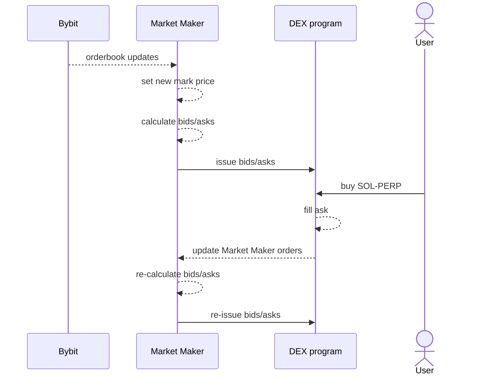

# Zeta Market Maker

Provides liquidity to Zeta DEX, by issuing bid & ask quotes per asset and instrument. Monitors mark price from external exchange via web sockets, monitors quote orders via both web sockets and periodic refreshes.



Comprises modules:

- [app.ts](src/app.ts) - entrypoint with stale price check
- [maker.ts](src/maker.ts) - listens to external exchange (Bybit) orderbooks for mark price, monitors Zeta order updates, maintains current state
- [state.ts](src/state.ts) - keeps mark prices (theos) and issued quotes
- [types.ts](src/types.ts) - defines common types
- [utils.ts](src/utils.ts) & [math.ts](src/math.ts) - mathematical and utility functions
- [configuration.ts](src/configuration.ts) - parametrizes quoting strategy as per [config.json](config.json)

[config.json](config.json) parameters:

- exchanges/connection params
  - `network` - network on which the Zeta DEX program is deployed
  - `programId` - Zeta DEX programId
  - `endpoint` - RPC node url
  - `markExchange` - which exchange to source mark prices from
- time based params
  - `requoteIntervalMs` - frequency of Zeta quote periodic refresh
  - `markPriceStaleIntervalMs` - frequency of the stale price check, breach of which results in program exit
- asset params
  - `quoteLotSize` - lot sizes for the given instrument
  - `widthBps` - defines the spread between bid & ask
  - `requoteBps` - defines the margin which once breached triggers re-quoting
  - `quoteCashDelta` - cash amount offered on bid & ask

## Setup

Ensure `makerWallet.json` file exists in project root dir, in format:

```json
[
  111, 111, 111, 111, 111, 111, 111, 111, 111, 111, 111, 111, 111, 111, 111,
  111, 111, 111, 111, 111, 111, 111, 111, 111, 111, 111, 111, 111, 111, 111,
  111, 111, 111, 111, 111, 111, 111, 111, 111, 111, 111, 111, 111, 111, 111,
  111, 111, 111, 111, 111, 111, 111, 111, 111, 111, 111, 111, 111, 111, 111,
  111, 111, 111, 111
]
```

Install dependencies:

```sh
npm i
```

## Run

```sh
ts-node src/app.ts
```
